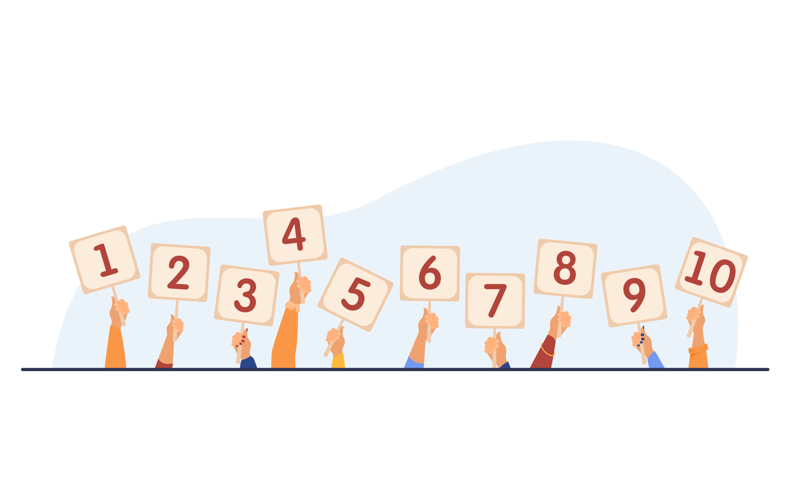

# Jeu du numéro mystère

L'objectif est de créer une petite application web qui permet à l'utilisateur de deviner un numéro mystère entre 1 et 10, avec un maximum de 3 essais. Cette application testera l'interaction entre JavaScript et HTML pour gérer des événements et des conditions.

    

## Contexte du projet

Je suis formateur en développement web et je vais aborder des notions clés comme la manipulation du DOM avec JavaScript, l'écoute d'événements, ainsi que la gestion des conditions et des boucles.

J'ai besoin d'une application sous forme de jeu qui demande à l'utilisateur de saisir un nombre entre 1 et 10 pour deviner le numéro mystère généré aléatoirement.  
Les indices "plus" et "moins" sont fournis après chaque tentative pour aider l'utilisateur, qui dispose de 3 essais.

À vous de jouer 😃!

## Modalités pédagogiques

**Activité individuelle en mode collaboratif.**

### Étape 1 : Création de l'interface utilisateur

- Implémentez une interface simple avec un champ d'entrée pour que l'utilisateur puisse saisir un nombre entre 1 et 10.
- Ajoutez un bouton pour valider le choix de l'utilisateur.
- Préparez un conteneur pour afficher les résultats et les indices.

Exemples dans le dossier `images`.

### Étape 2 : Logique du jeu

- Utilisez JavaScript pour générer un numéro mystère aléatoire entre 1 et 10.
- Permettez à l'utilisateur de saisir un nombre via le champ de saisie.
- Implémentez la logique permettant de vérifier si le nombre entré est supérieur, inférieur ou égal au numéro mystère, et affichez un indice en conséquence.
- Limitez les essais à 3 tentatives.

### Étape 3 : Gestion des essais et affichage du résultat

- Affichez dynamiquement le nombre d'essais effectués ou restants après chaque tentative.
- Si le numéro mystère est trouvé à la première, deuxième ou troisième tentative, affichez un message indiquant à l'utilisateur qu'il a gagné.
- Après 3 tentatives, affichez un message indiquant à l'utilisateur qu'il a perdu et révélez le numéro mystère.
- Permettez de relancer une nouvelle partie avec un bouton “Rejouer”.

### Bonus

- Ajoutez une animation ou un effet visuel pour rendre l'application plus interactive (par exemple, un délai avant l'affichage du résultat après chaque tentative).
- Proposez 3 niveaux de difficulté :
    - Facile (3 essais entre 1 et 10).
    - Moyen (2 essais entre 1 et 50).
    - Difficile (1 essai entre 1 et 100).

### Deadline

Livraison du projet dans 2 jours à compter du début du brief.

## Modalités d'évaluation

- Correction entre pairs à l'aide d'une grille d'évaluation.

## Livrables

- Un dépôt GitHub.
- Un screen de votre grille d'évaluation.

## Critères de performance

- Ajoutez la grille d'évaluation ci-dessous dans le README de la personne que vous corrigez.
- Pensez à compléter le ***nom de la personne corrigée*** et le ***nom du correcteur*** dans l'entête du tableau.
- Indiquez le **nombre d'étoiles obtenues** (l'étoile d'une catégorie est obtenue si tous ses critères de performance sont validés).

| *nom de la personne corrigée*           |                               | *nom du correcteur*     |
| :---- | :----: | :---: |
| Critères de performance                 |                               | Remarques du correcteur |
| ***Interface utilisateur***             |                               |                         |
| - L'interface est claire et intuitive   | <ul><li>- [ ] &nbsp;</li><ul> |                         |
| - Gestion des essais et des résultats   | <ul><li>- [ ] &nbsp;</li><ul> |                         |
|                                         | <ul><li>- [ ] ⭐</li><ul>     |                         |
| ***Fonctionnalités***                   |                               |                         |
| - Génération correcte du numéro mystère | <ul><li>- [ ] &nbsp;</li><ul> |                         |
| - Gestion des indices (plus/moins)      | <ul><li>- [ ] &nbsp;</li><ul> |                         |
| - Limitation des essais à 3 tentatives  | <ul><li>- [ ] &nbsp;</li><ul> |                         |
|                                         | <ul><li>- [ ] ⭐</li><ul>     |                         |
| ***Code***                              |                               |                         |
| - Organisation et lisibilité du code    | <ul><li>- [ ] &nbsp;</li><ul> |                         |
| - Respect des bonnes pratiques JS/HTML  | <ul><li>- [ ] &nbsp;</li><ul> |                         |
| - Commentaires dans le code             | <ul><li>- [ ] &nbsp;</li><ul> |                         |
|                                         | <ul><li>- [ ] ⭐</li><ul>     |                         |
| ***Bonus***                             |                               |                         |
| - Délai d'affichage                     | <ul><li>- [ ] &nbsp;</li><ul> |                         |
| - 3 niveaux de difficulté               | <ul><li>- [ ] &nbsp;</li><ul> |                         |
|                                         | <ul><li>- [ ] ⭐</li><ul>     |                         |
| ***Livrables***                         |                               |                         |
| - Projet livré dans les délais          | <ul><li>- [ ] &nbsp;</li><ul> |                         |
|                                         | <ul><li>- [ ] ⭐</li><ul>     |                         |

**Nombre d'étoiles obtenues** : ⭐⭐⭐⭐⭐

## Ressources

- [JavaScript](https://developer.mozilla.org/fr/docs/Web/JavaScript)

## Auteurs, contributeurs

- [Nicolas Herbez](https://github.com/nicolas-herbez)
